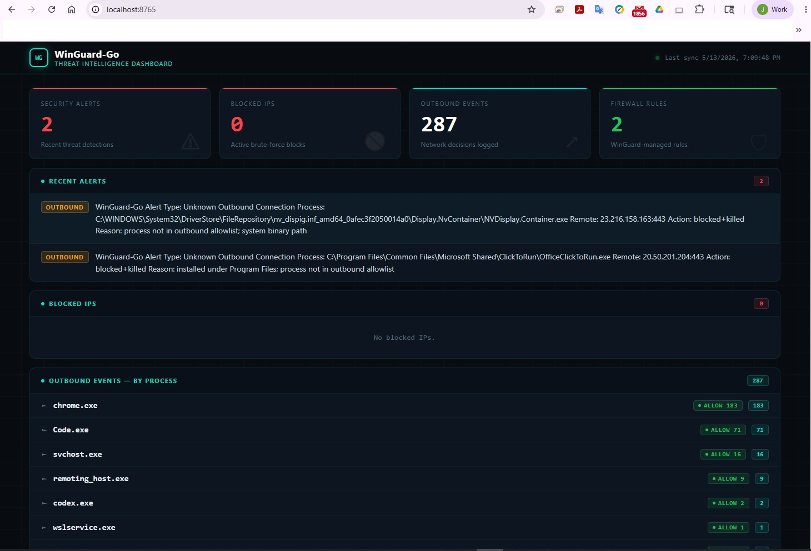

# WinGuard-Go Distribution

This directory contains the packaged WinGuard-Go distribution for Windows.

## Included files

- `winguard.exe`
  - The compiled WinGuard-Go executable.
  - Run this binary to start the agent or use it with service management commands.

- `configs/config.yaml`
  - The default runtime configuration used by WinGuard-Go.
  - Contains settings for:
    - `agent` (name, device name, dashboard address)
    - `bruteforce` detection and block policy
    - `firewall` integration and dry-run mode
    - `outbound` monitoring, allowlist/blocklist, and scan settings
    - `telegram` notification integration
    - `storage` path for the local database
  - Update this file before installation to customize behavior.

- `setup.ps1`
  - Windows PowerShell helper script for initial setup.
  - Copies the example configuration file to the active `configs` folder.
  - Installs the WinGuard service with the selected configuration.
  - Starts the `WinGuardGo` service.

## Configuration overview

The `configs/config.yaml` file controls all runtime behavior for WinGuard-Go. Key sections include:

- `agent`
  - `name`: Friendly agent name used in logs and telemetry.
  - `device_name`: Host identifier for the machine running the agent.
  - `dashboard_addr`: Local bind address for the built-in dashboard (e.g. `127.0.0.1:8765`).

- `bruteforce`
  - `enabled`: Turn brute-force detection on or off.
  - `threshold`: Number of failed attempts that triggers a block.
  - `window_minutes`: Time window in minutes to count failed login attempts.
  - `block_minutes`: Duration in minutes to keep the source blocked after detection.

- `firewall`
  - `enabled`: Enable or disable firewall integration.
  - `dry_run`: When `true`, firewall actions are evaluated but not actually applied.
  - `rule_prefix`: Prefix used for WinGuard-managed firewall rule names.

- `outbound`
  - `enabled`: Enable or disable outbound connection monitoring.
  - `mode`: `block` or `alert` mode for suspicious outbound connections.
  - `scan_interval_seconds`: How often outbound events are evaluated.
  - `suspicious_paths`: Paths that increase suspicion for outbound connections.
  - `blocklist`: Process names that should be blocked when seen outbound.
  - `allowlist`: Exact process paths or names allowed to make outbound connections.

- `telegram`
  - `enabled`: Enable Telegram notifications.
  - `bot_token`: Telegram bot API token.
  - `chat_id`: Chat ID where notifications will be sent.

- `storage`
  - `path`: Local data store path used by the agent.

Update these values before installation to ensure the agent behaves correctly for your environment.

## Getting started

1. Review and edit `configs/config.yaml` to match your environment.
2. Open an elevated PowerShell prompt (Run as Administrator).
3. Run:
   ```powershell
   ./setup.ps1
   ```
4. Verify that the `WinGuardGo` service is installed and running.

## Dashboard screenshot



## Notes

- The PowerShell setup script assumes the working directory is the `dist` folder.
- Adjust the `dashboard_addr` in `configs/config.yaml` if you need a different dashboard bind address.
- If you enable Telegram notifications, fill in `telegram.bot_token` and `telegram.chat_id`.

## Troubleshooting

If the service does not start or you need to manage it manually, use these commands in an elevated PowerShell prompt:

- Install the service:
  ```powershell
  .\winguard.exe install-service --config .\configs\config.yaml
  ```
- Start the service:
  ```powershell
  sc.exe start WinGuardGo
  ```
- Stop the service:
  ```powershell
  sc.exe stop WinGuardGo
  ```

If the service fails to start, check the Windows Event Viewer or the service logs for details and confirm the configuration file path is correct.
